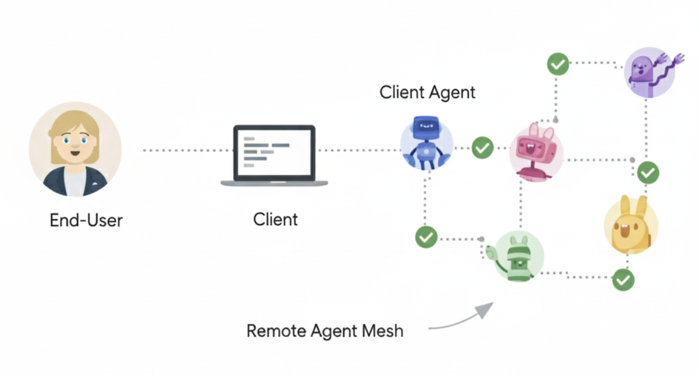

# Core Concepts and Components in A2A

A2A uses a set of core concepts that define how agents interact.
Understand these core building blocks to develop or integrate with A2A-compliant
systems.

{ width="70%" style="margin:20px auto;display:block;" }

## Core Actors in A2A Interactions

- **User**: The end user, which can be a human operator or an automated
    service. The user initiates a request or defines a goal that requires
    assistance from one or more AI agents.
- **A2A Client (Client Agent)**: An application, service, or another AI agent
    that acts on behalf of the user. The client initiates communication using the
    A2A protocol.
- **A2A Server (Remote Agent)**: An AI agent or an agentic system that exposes
    an HTTP endpoint implementing the A2A protocol. It receives requests from
    clients, processes tasks, and returns results or status updates. From the client's perspective,
    the remote agent operates as an _opaque_ (black-box) system, meaning its internal workings, memory, or tools are not exposed.

## Fundamental Communication Elements

The following table describes the fundamental communication elements in A2A:

| Element | Description | Key Purpose |
| :------ | :---------- | :---------- |
| Agent Card | A JSON metadata document describing an agent's identity, capabilities, endpoint, skills, and authentication requirements. | Enables clients to discover agents and understand how to interact with them securely and effectively. |
| Task | A stateful unit of work initiated by an agent, with a unique ID and defined lifecycle. | Facilitates tracking of long-running operations and enables multi-turn interactions and collaboration. |
| Message | A single turn of communication between a client and an agent, containing content and a role ("user" or "agent"). | Conveys instructions, context, questions, answers, or status updates that are not necessarily formal artifacts. |
| Part | The fundamental content container (for example, TextPart, FilePart, DataPart) used within Messages and Artifacts. | Provides flexibility for agents to exchange various content types within messages and artifacts. |
| Artifact | A tangible output generated by an agent during a task (for example, a document, image, or structured data). | Delivers the concrete results of an agent's work, ensuring structured and retrievable outputs. |

## Interaction Mechanisms

The A2A Protocol supports various interaction patterns to accommodate different
needs for responsiveness and persistence. These mechanisms ensure that agents
can exchange information efficiently and reliably, regardless of the task's
complexity or duration:

- **Request/Response (Polling)**: Clients send a request and the server
    responds. For long-running tasks, the client periodically polls the server
    for updates.
- **Streaming with Server-Sent Events (SSE)**: Clients initiate a stream to
    receive real-time, incremental results or status updates from the server
    over an open HTTP connection.
- **Push Notifications**: For very long-running tasks or disconnected
    scenarios, the server can actively send asynchronous notifications to a
    client-provided webhook when significant task updates occur.

For a detailed exploration of streaming and push notifications, refer to the
[Streaming & Asynchronous Operations](./streaming-and-async.md) document.

## Agent Cards

The Agent Card is a JSON document that serves as a digital business card for
initial discovery and interaction setup. It provides essential metadata about an
agent. Clients parse this information to determine if an agent is suitable for a
given task, how to structure requests, and how to communicate securely. Key
information includes identity, service endpoint (URL), A2A capabilities,
authentication requirements, and a list of skills.

## Messages and Parts

A message represents a single turn of communication between a client and an
agent. It includes a role ("user" or "agent") and a unique `messageId`. It
contains one or more Part objects, which are granular containers for the actual
content. This design allows A2A to be modality independent.

The primary part kinds are:

- `TextPart`: Contains plain textual content.
- `FilePart`: Represents a file. It can be transmitted either inline (Base64
   encoded) or through a URI. It includes metadata like "name" and "mimeType".
- `DataPart`: Carries structured JSON data. This is useful for forms,
   parameters, or any machine-readable information.

## Artifacts

An artifact represents a tangible output or a concrete result generated by a
remote agent during task processing. Unlike general messages, artifacts are the
actual deliverables. An artifact has a unique `artifactId`, a human-readable
name, and consists of one or more part objects. Artifacts are closely tied to the
task lifecycle and can be streamed incrementally to the client.

## Agent Response: Task or Message

The agent response can be a new `Task` (when the agent needs to perform a
long-running operation) or a `Message` (when the agent can respond immediately).

For more details, see [Life of a Task](./life-of-a-task.md).

## Other Important Concepts

- **Context (`contextId`):** A server-generated identifier that can be used to logically group multiple related `Task` objects, providing context across a series of interactions.
- **Transport and Format:** A2A communication occurs over HTTP(S). JSON-RPC 2.0 is used as the payload format for all requests and responses.
- **Authentication & Authorization:** A2A relies on standard web security practices. Authentication requirements are declared in the Agent Card, and credentials (e.g., OAuth tokens, API keys) are typically passed through HTTP headers, separate from the A2A protocol messages themselves. For more information, see [Enterprise-Ready Features](./enterprise-ready.md).
- **Agent Discovery:** The process by which clients find Agent Cards to learn about available A2A Servers and their capabilities. For more information, see [Agent Discovery](./agent-discovery.md).
- **Extensions:** A2A allows agents to declare custom protocol extensions as part of their AgentCard. For more information, see [Extensions](./extensions.md).
