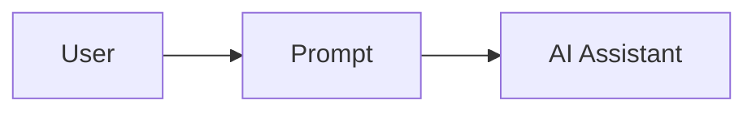
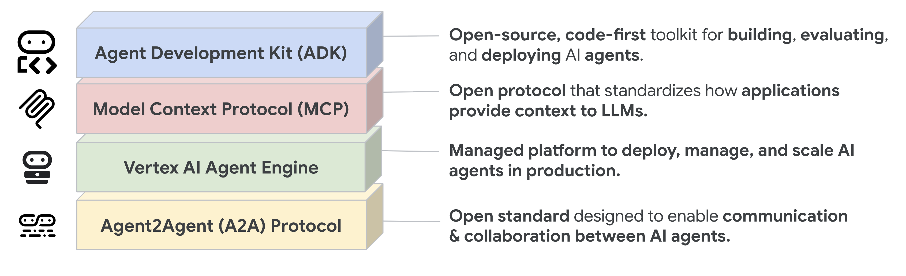
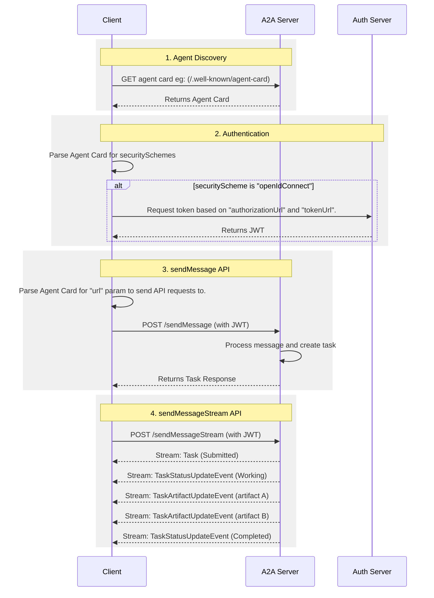

# What is A2A?

The A2A protocol is an open standard that enables seamless communication and
collaboration between AI agents. It provides a common language for agents built
using diverse frameworks and by different vendors, fostering interoperability
and breaking down silos. Agents are autonomous problem-solvers that act
independently within their environment. A2A allows agents from different
developers, built on different frameworks, and owned by different organizations
to unite and work together.

## Why Use the A2A Protocol

A2A addresses key challenges in AI agent collaboration. It provides
a standardized approach for agents to interact. This section explains the
problems A2A solves and the benefits it offers.

### Problems that A2A Solves

Consider a user request for an AI assistant to plan an international trip. This
task involves orchestrating multiple specialized agents, such as:

- A flight booking agent
- A hotel reservation agent
- An agent for local tour recommendations
- A currency conversion agent

Without A2A, integrating these diverse agents presents several challenges:

- **Agent Exposure**: Developers often wrap agents as tools to expose them to
    other agents, similar to how tools are exposed in a Multi-agent Control
    Platform (Model Context Protocol). However, this approach is inefficient because agents are
    designed to negotiate directly. Wrapping agents as tools limits their capabilities.
    A2A allows agents to be exposed as they are, without requiring this wrapping.
- **Custom Integrations**: Each interaction requires custom, point-to-point
    solutions, creating significant engineering overhead.
- **Slow Innovation**: Bespoke development for each new integration slows
    innovation.
- **Scalability Issues**: Systems become difficult to scale and maintain as
    the number of agents and interactions grows.
- **Interoperability**: This approach limits interoperability,
    preventing the organic formation of complex AI ecosystems.
- **Security Gaps**: Ad hoc communication often lacks consistent security
    measures.

The A2A protocol addresses these challenges by establishing interoperability for
AI agents to interact reliably and securely.

### A2A Example Scenario

This section provides an example scenario to illustrate the benefits of using an A2A (Agent2Agent) protocol for complex interactions between AI agents.

#### A User's Complex Request

A user interacts with an AI assistant, giving it a complex prompt like "Plan an international trip."

#### The Need for Collaboration

The AI assistant receives the prompt and realizes it needs to call upon multiple specialized agents to fulfill the request. These agents include a Flight Booking Agent, a Hotel Reservation Agent, a Currency Conversion Agent, and a Local Tours Agent.

```mermaid
graph LR
    subgraph "Specialized Agents"
        FBA[✈️ Flight Booking Agent]
        HRA[🏨 Hotel Reservation Agent]
        CCA[💱 Currency Conversion Agent]
        LTA[🚌 Local Tours Agent]
    end

    AI_Assistant[🤖 AI Assistant] --> FBA
    AI_Assistant --> HRA
    AI_Assistant --> CCA
    AI_Assistant --> LTA
```

#### The Interoperability Challenge

The core problem: The agents are unable to work together because each has its own bespoke development and deployment.

The consequence of a lack of a standardized protocol is that these agents cannot collaborate with each other let alone discover what they can do. The individual agents (Flight, Hotel, Currency, and Tours) are isolated.

#### The "With A2A" Solution

The A2A Protocol provides standard methods and data structures for agents to communicate with one another, regardless of their underlying implementation, so the same agents can be used as an interconnected system, communicating seamlessly through the standardized protocol.

The AI assistant, now acting as an orchestrator, receives the cohesive information from all the A2A-enabled agents. It then presents a single, complete travel plan as a seamless response to the user's initial prompt.

{ width="70%" style="margin:20px auto;display:block;" }

### Core Benefits of A2A

Implementing the A2A protocol offers significant advantages across the AI ecosystem:

- **Secure collaboration**: Without a standard, it's difficult to ensure
    secure communication between agents. A2A uses HTTPS for secure communication
    and maintains opaque operations, so agents can't see the inner workings of
    other agents during collaboration.
- **Interoperability**: A2A breaks down silos between different AI
    agent ecosystems, enabling agents from various vendors and frameworks to work
    together seamlessly.
- **Agent autonomy**: A2A allows agents to retain their individual capabilities
    and act as autonomous entities while collaborating with other agents.
- **Reduced integration complexity**: The protocol standardizes agent
    communication, enabling teams to focus on the unique value their agents
    provide.
- **Support for LRO**: The protocol supports long-running operations (LRO) and
    streaming with Server-Sent Events (SSE) and asynchronous execution.

### Key Design Principles of A2A

A2A development follows principles that prioritize broad adoption,
enterprise-grade capabilities, and future-proofing.

- **Simplicity**: A2A leverages existing standards like HTTP, JSON-RPC, and
    Server-Sent Events (SSE). This avoids reinventing core technologies and
    accelerates developer adoption.
- **Enterprise Readiness**: A2A addresses critical enterprise needs. It aligns
    with standard web practices for robust authentication, authorization,
    security, privacy, tracing, and monitoring.
- **Asynchronous**: A2A natively supports long-running tasks. It handles
    scenarios where agents or users might not remain continuously connected. It
    uses mechanisms like streaming and push notifications.
- **Modality Independent**: The protocol allows agents to communicate using a
    wide variety of content types. This enables rich and flexible interactions
    beyond plain text.
- **Opaque Execution**: Agents collaborate effectively without exposing their
    internal logic, memory, or proprietary tools. Interactions rely on declared
    capabilities and exchanged context. This preserves intellectual property and
    enhances security.

### Understanding the Agent Stack: A2A, MCP, Agent Frameworks and Models

A2A is situated within a broader agent stack, which includes:

- **A2A:** Standardizes communication among agents deployed in different organizations and developed using diverse frameworks.
- **MCP:** Connects models to data and external resources.
- **Frameworks (like ADK):** Provide toolkits for constructing agents.
- **Models:** Fundamental to an agent's reasoning, these can be any Large Language Model (LLM).

{ width="70%" style="margin:20px auto;display:block;" }

#### A2A and MCP

In the broader ecosystem of AI communication, you might be familiar with protocols designed to facilitate interactions between agents, models, and tools. Notably, the Model Context Protocol (MCP) is an emerging standard focused on connecting Large Language Models (LLMs) with data and external resources.

The Agent2Agent (A2A) protocol is designed to standardize communication between AI agents, particularly those deployed in external systems. A2A is positioned to complement MCP, addressing a distinct yet related aspect of agent interaction.

- **MCP's Focus:** Reducing the complexity involved in connecting agents with tools and data. Tools are typically stateless and perform specific, predefined functions (e.g., a calculator, a database query).
- **A2A's Focus:** Enabling agents to collaborate within their native modalities, allowing them to communicate as agents (or as users) rather than being constrained to tool-like interactions. This enables complex, multi-turn interactions where agents reason, plan, and delegate tasks to other agents. For example, this facilitates multi-turn interactions, such as those involving negotiation or clarification when placing an order.

{ width="70%" style="margin:20px auto;display:block;" }

The practice of encapsulating an agent as a simple tool is fundamentally limiting, as it fails to capture the agent's full capabilities. This critical distinction is explored in the post, [Why Agents Are Not Tools](https://discuss.google.dev/t/agents-are-not-tools/192812).

For a more in-depth comparison, refer to the [A2A and MCP Comparison](a2a-and-mcp.md) document.

#### A2A and ADK

The [Agent Development Kit (ADK)](https://google.github.io/adk-docs)
is an open-source agent development toolkit developed by Google. A2A is a
communication protocol for agents that enables inter-agent communication,
regardless of the framework used for their construction (e.g., ADK, LangGraph,
or Crew AI). ADK is a flexible and modular framework for developing and
deploying AI agents. While optimized for Gemini AI and the Google ecosystem,
ADK is model-agnostic, deployment-agnostic, and built for compatibility with
other frameworks.

### A2A Request Lifecycle

The A2A request lifecycle is a sequence that details the four main steps a request follows: agent discovery, authentication, `sendMessage` API, and `sendMessageStream` API. The following diagram provides a deeper look into the operational flow, illustrating the interactions between the client, A2A server, and auth server.

## What's Next

Learn about the [Key Concepts](./key-concepts.md) that form the foundation of the A2A protocol.
